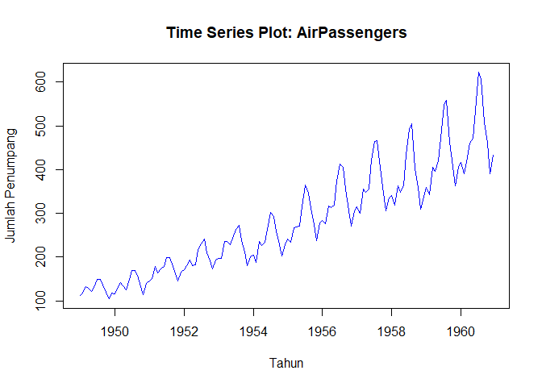
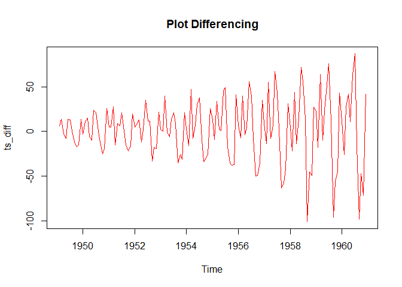
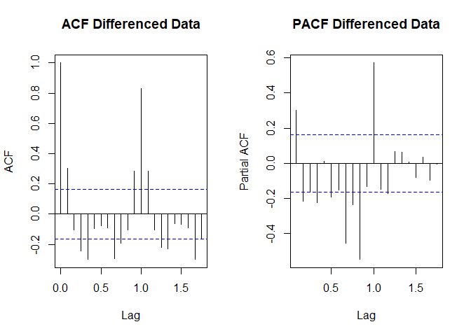
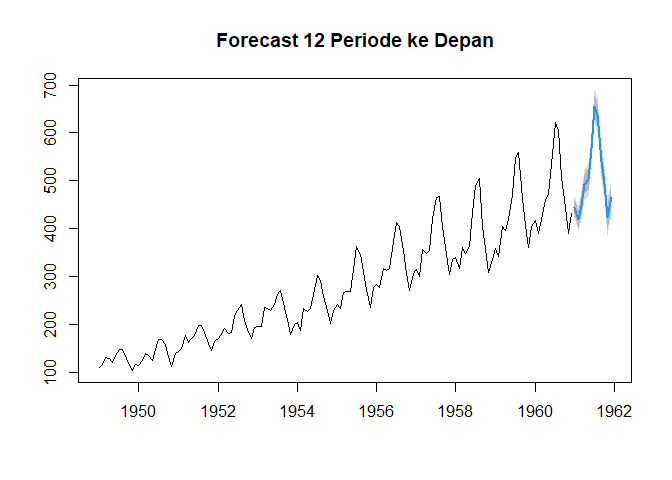
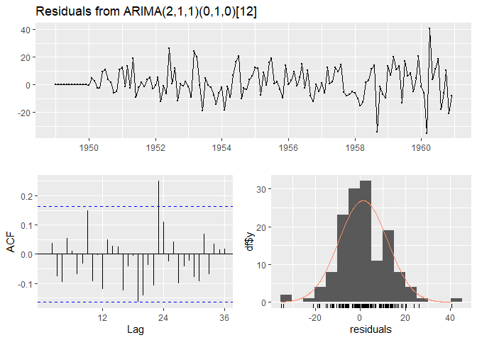
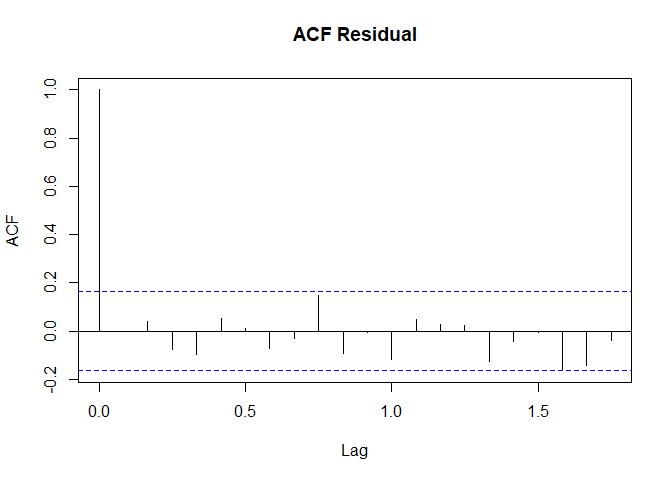

Analisis Time Series: AirPassengers dengan ARIMA
================

# Pendahuluan

Dataset **AirPassengers** merupakan data jumlah penumpang pesawat
bulanan dari tahun 1949 hingga 1960. Data ini memiliki pola tren dan
musiman yang jelas.

------------------------------------------------------------------------

# Persiapan Library

``` r
if(!require(forecast)) install.packages("forecast")
```

    ## Loading required package: forecast

    ## Warning: package 'forecast' was built under R version 4.4.3

``` r
if(!require(tseries)) install.packages("tseries")
```

    ## Loading required package: tseries

    ## Warning: package 'tseries' was built under R version 4.4.3

    ## Registered S3 method overwritten by 'quantmod':
    ##   method            from
    ##   as.zoo.data.frame zoo

``` r
library(forecast)
library(tseries)

data(AirPassengers)
ts_data <- AirPassengers

ts_data
```

    ##      Jan Feb Mar Apr May Jun Jul Aug Sep Oct Nov Dec
    ## 1949 112 118 132 129 121 135 148 148 136 119 104 118
    ## 1950 115 126 141 135 125 149 170 170 158 133 114 140
    ## 1951 145 150 178 163 172 178 199 199 184 162 146 166
    ## 1952 171 180 193 181 183 218 230 242 209 191 172 194
    ## 1953 196 196 236 235 229 243 264 272 237 211 180 201
    ## 1954 204 188 235 227 234 264 302 293 259 229 203 229
    ## 1955 242 233 267 269 270 315 364 347 312 274 237 278
    ## 1956 284 277 317 313 318 374 413 405 355 306 271 306
    ## 1957 315 301 356 348 355 422 465 467 404 347 305 336
    ## 1958 340 318 362 348 363 435 491 505 404 359 310 337
    ## 1959 360 342 406 396 420 472 548 559 463 407 362 405
    ## 1960 417 391 419 461 472 535 622 606 508 461 390 432

``` r
plot(ts_data,
     main = "Time Series Plot: AirPassengers",
     col  = "blue",
     ylab = "Jumlah Penumpang",
     xlab = "Tahun")
```

<!-- -->

``` r
adf.test(ts_data)
```

    ## Warning in adf.test(ts_data): p-value smaller than printed p-value

    ## 
    ##  Augmented Dickey-Fuller Test
    ## 
    ## data:  ts_data
    ## Dickey-Fuller = -7.3186, Lag order = 5, p-value = 0.01
    ## alternative hypothesis: stationary

``` r
ts_diff <- diff(ts_data)

plot(ts_diff,
     main = "Plot Differencing",
     col = "red")
```

<!-- -->

``` r
adf.test(ts_diff)
```

    ## Warning in adf.test(ts_diff): p-value smaller than printed p-value

    ## 
    ##  Augmented Dickey-Fuller Test
    ## 
    ## data:  ts_diff
    ## Dickey-Fuller = -7.0177, Lag order = 5, p-value = 0.01
    ## alternative hypothesis: stationary

``` r
par(mfrow = c(1,2))

acf(ts_diff, main = "ACF Differenced Data")
pacf(ts_diff, main = "PACF Differenced Data")
```

<!-- -->

``` r
par(mfrow = c(1,1))

model_manual <- arima(ts_data, order = c(1,1,1))
summary(model_manual)
```

    ## 
    ## Call:
    ## arima(x = ts_data, order = c(1, 1, 1))
    ## 
    ## Coefficients:
    ##           ar1     ma1
    ##       -0.4741  0.8634
    ## s.e.   0.1159  0.0720
    ## 
    ## sigma^2 estimated as 962.2:  log likelihood = -694.34,  aic = 1394.68
    ## 
    ## Training set error measures:
    ##                  ME     RMSE      MAE       MPE     MAPE      MASE       ACF1
    ## Training set 1.9209 30.91125 24.12176 0.4150742 8.566115 0.7530918 0.03749257

``` r
model_auto <- auto.arima(ts_data)
summary(model_auto)
```

    ## Series: ts_data 
    ## ARIMA(2,1,1)(0,1,0)[12] 
    ## 
    ## Coefficients:
    ##          ar1     ar2      ma1
    ##       0.5960  0.2143  -0.9819
    ## s.e.  0.0888  0.0880   0.0292
    ## 
    ## sigma^2 = 132.3:  log likelihood = -504.92
    ## AIC=1017.85   AICc=1018.17   BIC=1029.35
    ## 
    ## Training set error measures:
    ##                  ME     RMSE     MAE      MPE     MAPE     MASE        ACF1
    ## Training set 1.3423 10.84619 7.86754 0.420698 2.800458 0.245628 -0.00124847

``` r
forecast_result <- forecast(model_auto, h = 12)

plot(forecast_result,
     main = "Forecast 12 Periode ke Depan")
```

<!-- -->

``` r
checkresiduals(model_auto)
```

<!-- -->

    ## 
    ##  Ljung-Box test
    ## 
    ## data:  Residuals from ARIMA(2,1,1)(0,1,0)[12]
    ## Q* = 37.784, df = 21, p-value = 0.01366
    ## 
    ## Model df: 3.   Total lags used: 24

``` r
residuals_model <- residuals(model_auto)

mean_res <- mean(residuals_model)
var_res  <- var(residuals_model)

mean_res
```

    ## [1] 1.3423

``` r
var_res
```

    ## [1] 116.6481

``` r
acf(residuals_model,
    main = "ACF Residual")
```

<!-- -->

``` r
lb_test <- Box.test(residuals_model,
                    lag = 20,
                    type = "Ljung-Box")

lb_test
```

    ## 
    ##  Box-Ljung test
    ## 
    ## data:  residuals_model
    ## X-squared = 22.524, df = 20, p-value = 0.3128

``` r
if(lb_test$p.value > 0.05){
  cat("Residual bersifat white noise, model ARIMA sudah baik")
} else {
  cat("Residual belum white noise, model ARIMA belum optimal")
}
```

    ## Residual bersifat white noise, model ARIMA sudah baik
