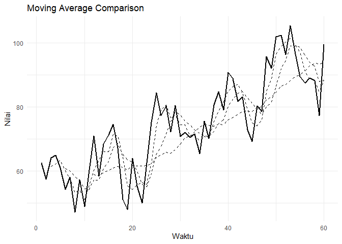
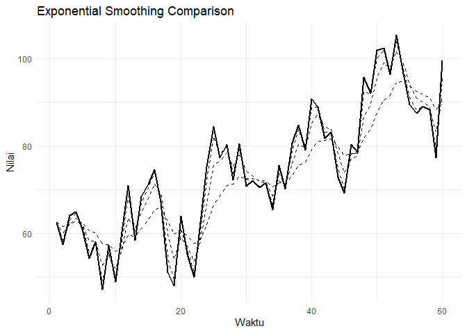

Time Series Smoothing: Moving Average & Exponential Smoothing
================

# Pendahuluan

Dokumen ini membahas metode smoothing pada time series: - Moving Average
(MA) - Exponential Smoothing (SES, Holt, Holt-Winters, ETS)

------------------------------------------------------------------------

# Persiapan Library

``` r
# install.packages(c("forecast", "ggplot2", "dplyr"))

library(forecast)
```

    ## Warning: package 'forecast' was built under R version 4.4.3

``` r
library(ggplot2)
```

    ## Warning: package 'ggplot2' was built under R version 4.4.3

``` r
library(dplyr)
```

    ## Warning: package 'dplyr' was built under R version 4.4.3

    ## 
    ## Attaching package: 'dplyr'

    ## The following objects are masked from 'package:stats':
    ## 
    ##     filter, lag

    ## The following objects are masked from 'package:base':
    ## 
    ##     intersect, setdiff, setequal, union

``` r
set.seed(42)
n <- 60

waktu   <- 1:n
tren    <- 50 + 0.8 * waktu
musiman <- 10 * sin(2 * pi * waktu / 12)
noise   <- rnorm(n, mean = 0, sd = 5)

penjualan <- tren + musiman + noise
ts_data <- ts(penjualan, start = c(2020, 1), frequency = 12)

ts_data
```

    ##            Jan       Feb       Mar       Apr       May       Jun       Jul
    ## 2020  62.65479  57.43676  64.21564  65.02457  61.02134  54.26938  58.15761
    ## 2021  58.45570  68.46631  71.33339  74.64001  67.17874  51.11772  47.99767
    ## 2022  84.47597  77.30791  80.31365  72.24444  80.50049  70.80003  72.07725
    ## 2023  80.67770  84.80572  79.12896  90.84087  88.82999  81.79471  83.19082
    ## 2024  92.04277 101.93849 102.40963  96.34106 105.27864  96.41450  89.44880
    ##            Aug       Sep       Oct       Nov       Dec
    ## 2020  47.26645  57.29212  49.02618  60.32435  71.03323
    ## 2021  63.94031  55.26681  50.03320  62.54041  75.27337
    ## 2022  70.46393  71.57552  65.49511  75.52478  70.21496
    ## 2023  72.90622  69.15859  80.30384  78.54303  95.62051
    ## 2024  87.52250  88.99644  88.18891  77.23455  99.42441

``` r
moving_average <- function(x, k) {
  n  <- length(x)
  ma <- rep(NA, n)
  for (i in k:n) {
    ma[i] <- mean(x[(i - k + 1):i])
  }
  return(ma)
}

ma3  <- moving_average(penjualan, 3)
ma6  <- moving_average(penjualan, 6)
ma12 <- moving_average(penjualan, 12)

ma3_filter  <- stats::filter(penjualan, rep(1/3, 3), sides = 1)
ma6_filter  <- stats::filter(penjualan, rep(1/6, 6), sides = 1)
ma12_filter <- stats::filter(penjualan, rep(1/12, 12), sides = 1)

ma_centered <- stats::filter(penjualan,
                             filter = c(0.5, rep(1, 11), 0.5) / 12,
                             sides = 2)

ma_centered
```

    ## Time Series:
    ## Start = 1 
    ## End = 60 
    ## Frequency = 1 
    ##  [1]       NA       NA       NA       NA       NA       NA 58.80191 59.08651
    ##  [9] 59.84265 60.53986 61.19706 61.32230 60.76765 61.03907 61.64942 61.60699
    ## [17] 61.74129 62.01030 63.27115 64.72373 65.46630 65.74067 66.19592 67.57109
    ## [25] 69.39450 70.66964 71.62098 72.94476 74.13002 74.46027 74.09124 74.24539
    ## [33] 74.50844 75.23392 76.35584 77.16101 78.08219 78.64702 78.64807 79.16440
    ## [41] 79.90719 81.09152 82.62362 83.81103 85.49493 86.69413 87.60867 88.90318
    ## [49] 89.77309 90.64285 92.07844 93.23356 93.50759 93.61156       NA       NA
    ## [57]       NA       NA       NA       NA

``` r
bobot <- c(1, 2, 3)
bobot <- bobot / sum(bobot)

moving_average_weighted <- function(x, w) {
  k  <- length(w)
  n  <- length(x)
  wma <- rep(NA, n)
  for (i in k:n) {
    wma[i] <- sum(x[(i - k + 1):i] * w)
  }
  return(wma)
}

wma_3 <- moving_average_weighted(penjualan, bobot)

ses_manual <- function(x, alpha) {
  n <- length(x)
  s <- rep(NA, n)
  s[1] <- x[1]
  for (i in 2:n) {
    s[i] <- alpha * x[i] + (1 - alpha) * s[i - 1]
  }
  return(s)
}

ses_02 <- ses_manual(penjualan, 0.2)
ses_05 <- ses_manual(penjualan, 0.5)
ses_08 <- ses_manual(penjualan, 0.8)

ses_auto <- ses(ts_data, h = 12, alpha = 0.3)
ses_auto
```

    ##          Point Forecast    Lo 80    Hi 80    Lo 95    Hi 95
    ## Jan 2025       90.45576 79.05314 101.8584 73.01696 107.8945
    ## Feb 2025       90.45576 78.55108 102.3604 72.24912 108.6624
    ## Mar 2025       90.45576 78.06935 102.8422 71.51238 109.3991
    ## Apr 2025       90.45576 77.60566 103.3058 70.80323 110.1083
    ## May 2025       90.45576 77.15814 103.7534 70.11880 110.7927
    ## Jun 2025       90.45576 76.72519 104.1863 69.45667 111.4548
    ## Jul 2025       90.45576 76.30548 104.6060 68.81478 112.0967
    ## Aug 2025       90.45576 75.89787 105.0136 68.19140 112.7201
    ## Sep 2025       90.45576 75.50137 105.4101 67.58499 113.3265
    ## Oct 2025       90.45576 75.11511 105.7964 66.99426 113.9173
    ## Nov 2025       90.45576 74.73834 106.1732 66.41804 114.4935
    ## Dec 2025       90.45576 74.37039 106.5411 65.85531 115.0562

``` r
holt_model <- holt(ts_data, h = 12, alpha = 0.3, beta = 0.1)
summary(holt_model)
```

    ## 
    ## Forecast method: Holt's method
    ## 
    ## Model Information:
    ## Holt's method 
    ## 
    ## Call:
    ## holt(y = ts_data, h = 12, alpha = 0.3, beta = 0.1)
    ## 
    ##   Smoothing parameters:
    ##     alpha = 0.3 
    ##     beta  = 0.1 
    ## 
    ##   Initial states:
    ##     l = 62.0442 
    ##     b = -1.0155 
    ## 
    ##   sigma:  10.8494
    ## 
    ##      AIC     AICc      BIC 
    ## 533.6146 534.0432 539.8976 
    ## 
    ## Error measures:
    ##                       ME     RMSE      MAE       MPE     MAPE      MASE
    ## Training set -0.09057852 10.48154 8.597683 -1.153379 11.88903 0.8440911
    ##                   ACF1
    ## Training set 0.4767428
    ## 
    ## Forecasts:
    ##          Point Forecast    Lo 80     Hi 80     Lo 95    Hi 95
    ## Jan 2025       86.22195 72.31785 100.12605 64.957459 107.4864
    ## Feb 2025       84.66293 69.68775  99.63811 61.760373 107.5655
    ## Mar 2025       83.10391 66.59370  99.61412 57.853728 108.3541
    ## Apr 2025       81.54489 63.04669 100.04310 53.254328 109.8355
    ## May 2025       79.98587 59.08342 100.88832 48.018335 111.9534
    ## Jun 2025       78.42686 54.74902 102.10469 42.214732 114.6390
    ## Jul 2025       76.86784 50.08664 103.64903 35.909534 117.8261
    ## Aug 2025       75.30882 45.13339 105.48425 29.159483 121.4582
    ## Sep 2025       73.74980 39.91965 107.57994 22.011059 125.4885
    ## Oct 2025       72.19078 34.46989 109.91167 14.501661 129.8799
    ## Nov 2025       70.63176 28.80374 112.45978  6.661329 134.6022
    ## Dec 2025       69.07274 22.93709 115.20839 -1.485647 139.6311

``` r
hw_add <- HoltWinters(ts_data, seasonal = "additive")
```

    ## Warning in HoltWinters(ts_data, seasonal = "additive"): optimization
    ## difficulties: ERROR: ABNORMAL_TERMINATION_IN_LNSRCH

``` r
hw_mul <- HoltWinters(ts_data, seasonal = "multiplicative")

hw_add
```

    ## Holt-Winters exponential smoothing with trend and additive seasonal component.
    ## 
    ## Call:
    ## HoltWinters(x = ts_data, seasonal = "additive")
    ## 
    ## Smoothing parameters:
    ##  alpha: 0.0636201
    ##  beta : 0.1724132
    ##  gamma: 0.3982088
    ## 
    ## Coefficients:
    ##           [,1]
    ## a   96.9351766
    ## b    0.8306517
    ## s1   5.7391208
    ## s2  10.9455193
    ## s3  10.0129696
    ## s4   9.4114368
    ## s5  11.1129269
    ## s6  -0.1937994
    ## s7  -2.1702734
    ## s8  -6.5588349
    ## s9  -6.9178754
    ## s10 -7.9951558
    ## s11 -9.1392387
    ## s12  4.9502889

``` r
hw_mul
```

    ## Holt-Winters exponential smoothing with trend and multiplicative seasonal component.
    ## 
    ## Call:
    ## HoltWinters(x = ts_data, seasonal = "multiplicative")
    ## 
    ## Smoothing parameters:
    ##  alpha: 0.03749858
    ##  beta : 0.1909179
    ##  gamma: 0.4726455
    ## 
    ## Coefficients:
    ##           [,1]
    ## a   95.4819658
    ## b    0.8847727
    ## s1   1.0938964
    ## s2   1.1605799
    ## s3   1.1460637
    ## s4   1.1347871
    ## s5   1.1631223
    ## s6   1.0220786
    ## s7   0.9910150
    ## s8   0.9390772
    ## s9   0.9303027
    ## s10  0.9206468
    ## s11  0.8998585
    ## s12  1.0709307

``` r
ets_model <- ets(ts_data)
summary(ets_model)
```

    ## ETS(A,A,A) 
    ## 
    ## Call:
    ## ets(y = ts_data)
    ## 
    ##   Smoothing parameters:
    ##     alpha = 1e-04 
    ##     beta  = 1e-04 
    ##     gamma = 1e-04 
    ## 
    ##   Initial states:
    ##     l = 53.4375 
    ##     b = 0.6982 
    ##     s = 5.9131 -5.1179 -10.12 -6.6686 -6.8676 -6.7751
    ##            -3.5022 7.1024 6.3 8.1092 7.5655 4.0613
    ## 
    ##   sigma:  6.3629
    ## 
    ##      AIC     AICc      BIC 
    ## 483.1090 497.6804 518.7128 
    ## 
    ## Training set error measures:
    ##                      ME     RMSE      MAE       MPE     MAPE      MASE
    ## Training set -0.4120054 5.448838 4.280973 -1.314684 6.195381 0.4202913
    ##                    ACF1
    ## Training set 0.09490256

``` r
ets_forecast <- forecast(ets_model, h = 12)
ets_forecast
```

    ##          Point Forecast     Lo 80    Hi 80    Lo 95    Hi 95
    ## Jan 2025       99.93075  91.77640 108.0851 87.45975 112.4018
    ## Feb 2025      104.12958  95.97524 112.2839 91.65858 116.6006
    ## Mar 2025      105.36909  97.21475 113.5234 92.89809 117.8401
    ## Apr 2025      104.25643  96.10208 112.4108 91.78543 116.7274
    ## May 2025      105.75408  97.59973 113.9084 93.28307 118.2251
    ## Jun 2025       95.84524  87.69089 103.9996 83.37424 108.3163
    ## Jul 2025       93.26911  85.11475 101.4235 80.79810 105.7401
    ## Aug 2025       93.87095  85.71659 102.0253 81.39993 106.3420
    ## Sep 2025       94.76519  86.61083 102.9195 82.29417 107.2362
    ## Oct 2025       92.01003  83.85566 100.1644 79.53900 104.4811
    ## Nov 2025       97.70695  89.55258 105.8613 85.23592 110.1780
    ## Dec 2025      109.43344 101.27906 117.5878 96.96239 121.9045

``` r
hitung_akurasi <- function(aktual, prediksi) {
  aktual   <- aktual[!is.na(prediksi)]
  prediksi <- prediksi[!is.na(prediksi)]
  error    <- aktual - prediksi

  mae  <- mean(abs(error))
  rmse <- sqrt(mean(error^2))
  mape <- mean(abs(error / aktual)) * 100

  return(c(MAE = mae, RMSE = rmse, MAPE = mape))
}

akurasi <- data.frame(
  Model = c("MA3", "MA6", "MA12", "SES02", "SES05", "SES08"),
  rbind(
    hitung_akurasi(penjualan, ma3),
    hitung_akurasi(penjualan, ma6),
    hitung_akurasi(penjualan, ma12),
    hitung_akurasi(penjualan, ses_02),
    hitung_akurasi(penjualan, ses_05),
    hitung_akurasi(penjualan, ses_08)
  )
)

akurasi
```

    ##   Model      MAE     RMSE      MAPE
    ## 1   MA3 4.593187 5.592254  6.443942
    ## 2   MA6 6.990045 8.425398  9.571411
    ## 3  MA12 8.015719 9.651337 10.370462
    ## 4 SES02 5.871492 7.325588  8.041112
    ## 5 SES05 3.429922 4.141696  4.803653
    ## 6 SES08 1.355458 1.639181  1.919959

``` r
df_plot <- data.frame(
  t = waktu,
  Aktual = penjualan,
  MA3 = ma3,
  MA6 = ma6,
  MA12 = ma12,
  SES_02 = ses_02,
  SES_05 = ses_05,
  SES_08 = ses_08
)

ggplot(df_plot, aes(x = t)) +
  geom_line(aes(y = Aktual), linewidth = 0.8) +
  geom_line(aes(y = MA3), linetype = "dashed") +
  geom_line(aes(y = MA6), linetype = "dashed") +
  geom_line(aes(y = MA12), linetype = "dashed") +
  labs(title = "Moving Average Comparison",
       x = "Waktu",
       y = "Nilai") +
  theme_minimal()
```

    ## Warning: Removed 2 rows containing missing values or values outside the scale range
    ## (`geom_line()`).

    ## Warning: Removed 5 rows containing missing values or values outside the scale range
    ## (`geom_line()`).

    ## Warning: Removed 11 rows containing missing values or values outside the scale range
    ## (`geom_line()`).

<!-- -->

``` r
ggplot(df_plot, aes(x = t)) +
  geom_line(aes(y = Aktual), linewidth = 0.8) +
  geom_line(aes(y = SES_02), linetype = "dashed") +
  geom_line(aes(y = SES_05), linetype = "dashed") +
  geom_line(aes(y = SES_08), linetype = "dashed") +
  labs(title = "Exponential Smoothing Comparison",
       x = "Waktu",
       y = "Nilai") +
  theme_minimal()
```

<!-- -->
